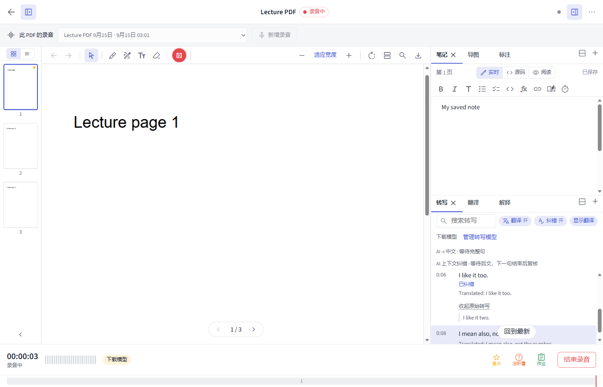

# MarkPDF

**[下载 Windows 安装包（.exe）](https://github.com/QianMo0729/MarkPDF/releases/download/v0.1.3/MarkPDF_0.1.3_x64-setup.exe)** · **[下载 macOS 安装包（Apple 芯片）](https://github.com/QianMo0729/MarkPDF/releases/download/v0.1.3/MarkPDF_0.1.3_aarch64.dmg)** · [所有版本](https://github.com/QianMo0729/MarkPDF/releases) · [v0.1.3 更新说明](docs/RELEASE_NOTES_0.1.3.md)

把 PDF、Markdown 笔记和课堂录音放在一起。围绕同一份课件阅读、标注、记录和回听，自由安排笔记、转写与翻译面板。

## 安装与开始使用

1. 打开 [Releases 下载页](https://github.com/QianMo0729/MarkPDF/releases/latest)，在 **Assets** 中下载 `MarkPDF_0.1.3_x64-setup.exe`。
2. 双击安装包，按安装向导完成安装。使用 MarkPDF **不需要安装 Node.js 或 Rust**。若电脑缺少 WebView2，安装器会联网下载所需运行组件。
3. 新建课程并导入 PDF，即可阅读和记笔记。需要录音时，在该 PDF 顶部点击「新增录音」。

当前安装包未进行代码签名，Windows 可能显示 SmartScreen 提示。请确认下载来源为本仓库的 Releases 页面。

### macOS

macOS 版（Apple 芯片，macOS 11 及以上）可从 [Releases 下载页](https://github.com/QianMo0729/MarkPDF/releases/latest) 下载 `MarkPDF_0.1.3_aarch64.dmg`。打开 `.dmg`，把 MarkPDF 拖入“应用程序”。也可以[从源码构建](docs/BUILDING.md#macos)。

- 应用未经 Apple 公证。若 `.dmg` 是从网上下载的，首次打开会被拦下：到“系统设置 → 隐私与安全性”点“仍要打开”。
- 首次录音时系统会询问麦克风权限；拒绝后可在“系统设置 → 隐私与安全性 → 麦克风”中重新打开。
- 界面遵循 macOS 的习惯：菜单栏包含全部命令，快捷键用 ⌘（如 ⇧⌘R 开始 / 结束录音、⌘, 打开设置），外观与强调色跟随系统设置。在访达中可用“打开方式”把 PDF 交给 MarkPDF。
- “打印”会在“预览”中打开带标注的 PDF，按 ⌘P 打印。

## 可以做什么

- **围绕 PDF 管理录音**：一份 PDF 可保留多段录音，随时选择回放或只阅读课件；课程放错时，可将课件及其录音一起移到另一课程。
- **阅读与标注**：单页或连续阅读、缩放、旋转、目录、搜索，以及高亮、手写、文本框和带标注 PDF 导出。通过链接跳转后，可返回先前的阅读位置。
- **Markdown 笔记**：实时预览、源码与阅读模式，支持公式、页面链接和录音时间戳。回放时默认显示当前笔记，也可切换查看当时的笔记。
- **自由分栏**：标签栏右侧的分栏图标一键上下分栏，当前标签留在上方，上一个标签进入下方；右键可选择左右分栏。每栏都有标签和「+」，支持拖动组合、调整大小并保存布局。
- **实时转写与翻译**：转写在句子尚未结束时跟随最新内容，主动回看时暂停跟随。开启「实时翻译」后，完整句逐条翻译并保存。
- **重新转写与删除录音**：回放时可用本机模型对整段录音重新转写（按当时的翻页归到各页），录音栏可直接重命名或删除当前录音。
- **可选上下文纠错**：用自己配置的 AI 服务检查同音词等转写错误，并在下一句结束后结合后文复核。默认关闭，修正后可展开核对原始转写，也能搜索原文。

*界面演示使用合成课件与示例转写，图中 AI 回复为测试数据。*

## 本地模型与 AI 服务

### 本地使用

- 实时转写使用本地语音模型，首次使用请到「设置 → 转写模型」下载。模型按下载大小分为轻量 / 标准 / 高精度 / 旗舰四档（≤200 / 500 / 1000 / 2000 MiB），每档标注建议内存与实际运行占用，中文有 2025 年的新模型可选。
- 中英互译默认使用 Mozilla Bergamot 本地引擎，在「设置 → 翻译与 AI」下载所需方向的模型。
- 模型首次下载需要网络，下载完成后可离线使用；本地转写和本地翻译不需要 AI 密钥。

### 用 ChatGPT 账号（Codex）

在「设置 → 翻译与 AI → 接入方式」选择 **ChatGPT 账号（Codex）**，需要本机有可用的 Codex CLI（可运行 `npm install -g @openai/codex` 安装，或填写 codex 可执行文件路径）。macOS 会自动查找 Homebrew、nvm 等常见安装位置，以及 `/Applications`、`~/Applications` 中 Codex / ChatGPT 应用包内的 CLI；也支持手动填写 `.app` 路径或以 `~/` 开头的路径。点击「登录 ChatGPT」在浏览器完成登录后，可从列表里选择模型和推理强度，翻译、解释和纠错都走你的订阅额度，不需要 API Key。登录与令牌由 Codex 自己保存在 `~/.codex`，MarkPDF 不保存凭据。OpenAI 目前允许第三方工具通过 Codex 登录使用订阅，但条款没有明文承诺，政策可能变化。

### 使用自己的 AI 服务

在「设置 → 翻译与 AI」填写服务地址、API Key 和模型，并选择 **OpenAI 格式**或 **Claude 格式**。OpenAI 格式兼容 Chat Completions 与 Codex 使用的 Responses 接口。填写后可先测试连接。

AI 翻译、解释和上下文纠错会将相应文本发送到你配置的服务。本地翻译失败不会自动改用 AI；实时翻译与上下文纠错可以独立开关。上下文纠错用于辅助核对，原始转写会保留。

## 升级与数据

升级前请结束正在进行的录音，等待笔记保存，然后退出 MarkPDF。建议先备份本地数据目录（Windows：`%APPDATA%\com.markpdf.app\`；macOS：`~/Library/Application Support/com.markpdf.app/`），再运行新安装包。该目录包含课件、笔记数据库、录音和模型，升级时请保留；若安装向导先卸载旧版，请勿勾选删除应用数据。

当前版本提供 Windows x64 安装包和 macOS Apple 芯片安装包，以本地使用为主；账号同步、云端转写等功能尚未提供。

## 开发与反馈

- [从源码构建](docs/BUILDING.md)
- [v0.1.3 更新说明](docs/RELEASE_NOTES_0.1.3.md)
- [提交问题或建议](https://github.com/QianMo0729/MarkPDF/issues)
